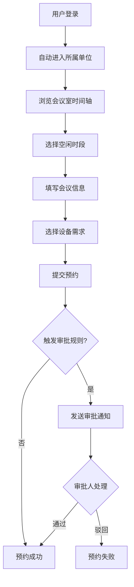
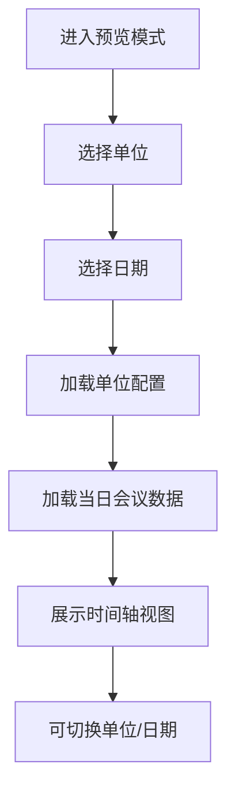

## 1. 产品概述

政企会议预约多租户平台是面向政府机关和企事业单位的统一会议室预约系统，支持多个单位共用一套前端系统，各单位独立配置楼层、审批规则、设备清单和节假日。用户登录后仅可见所属单位的会议室资源，同时提供预览模式可模拟查看任意单位的单日会议安排。

- 核心价值：解决多单位会议室资源分散管理、预约流程不统一的问题，实现集中部署、独立运营
- 目标用户：政府机关工作人员、企事业单位员工、行政管理人员

## 2. 核心功能

### 2.1 用户角色

| 角色 | 登录方式 | 核心权限 |
|------|----------|----------|
| 普通员工 | 账号密码登录 | 查看本单位会议室、发起预约、查看个人预约记录 |
| 部门审批人 | 账号密码登录 | 普通员工权限 + 审批本部门会议预约 |
| 单位管理员 | 账号密码登录 | 审批人权限 + 管理本单位会议室/楼层/设备/节假日/审批规则 |
| 系统管理员 | 账号密码登录 | 全部权限 + 租户管理、单位配置 |

### 2.2 功能模块

1. **登录页**：单位选择、账号登录、预览模式入口
2. **会议室概览**：楼层导航、会议室列表、状态展示、日期切换
3. **预约详情**：时间轴视图、会议信息、参会人员、设备需求
4. **新建预约**：选择会议室、填写会议信息、提交审批
5. **个人中心**：我的预约、待我审批、预约历史
6. **预览模式**：选择单位、选择日期、模拟查看当日全部会议安排
7. **单位配置**：楼层管理、设备清单、审批规则、节假日设置

### 2.3 页面详情

| 页面名称 | 模块名称 | 功能描述 |
|----------|----------|----------|
| 登录页 | 单位选择器 | 下拉选择所属单位，支持搜索 |
| 登录页 | 登录表单 | 账号密码输入、记住登录、登录按钮 |
| 登录页 | 预览模式入口 | 无需登录，直接进入预览模式 |
| 会议室概览 | 顶部导航栏 | 单位名称、用户信息、日期切换、今日按钮 |
| 会议室概览 | 楼层侧边栏 | 楼层列表、房间数量统计、快速筛选 |
| 会议室概览 | 时间轴主区域 | 以时间轴形式展示各会议室当日预约情况 |
| 会议室概览 | 会议室卡片 | 房间名称、容纳人数、设备图标、状态标识 |
| 新建预约弹窗 | 基本信息 | 会议主题、参会人数、会议类型 |
| 新建预约弹窗 | 时间选择 | 日期、开始时间、结束时间、冲突检测 |
| 新建预约弹窗 | 设备需求 | 从单位设备清单中选择所需设备 |
| 新建预约弹窗 | 参会人员 | 添加参会人、备注信息 |
| 个人中心 | 我的预约 | 列表展示个人发起的预约，支持取消 |
| 个人中心 | 待我审批 | 展示待审批的预约，支持通过/驳回 |
| 预览模式 | 单位选择 | 选择要预览的单位 |
| 预览模式 | 日期选择 | 选择要查看的日期 |
| 预览模式 | 时间轴视图 | 展示所选单位当日全部会议安排 |
| 单位配置 | 楼层管理 | 增删改楼层信息、排序 |
| 单位配置 | 设备清单 | 管理本单位可用设备及数量 |
| 单位配置 | 审批规则 | 设置审批流程、审批人、免审批条件 |
| 单位配置 | 节假日 | 设置本单位节假日、调休安排 |

## 3. 核心流程

### 3.1 用户预约流程

用户登录系统后，选择所属单位自动进入该单位的会议室概览页面。通过楼层侧边栏筛选会议室，在时间轴上查看可用时段，点击空闲时段发起预约。填写会议信息并选择设备需求后提交，系统根据审批规则判断是否需要审批，无需审批则直接预约成功，需审批则进入审批流程。

### 3.2 预览模式流程

用户在登录页点击"预览模式"入口，选择目标单位和日期后，系统加载该单位的配置数据和当日会议安排，以时间轴形式展示全部会议室的占用情况，无需登录即可查看。

## 4. 用户界面设计

### 4.1 设计风格

- **主色调**：政务蓝（#165DFF），体现稳重、专业的政企风格
- **辅助色**：浅蓝灰背景、深灰文字、成功绿、警告橙、错误红
- **按钮风格**：圆角6px，主按钮实心填充，次要按钮描边
- **字体**：系统字体栈，优先使用 PingFang SC / Microsoft YaHei
- **布局风格**：左侧楼层导航 + 右侧时间轴主区域的经典管理后台布局
- **图标风格**：线性图标，简洁清晰，符合政务系统审美

### 4.2 页面设计概述

| 页面名称 | 模块名称 | UI 元素 |
|----------|----------|---------|
| 登录页 | 登录卡片 | 居中卡片布局、单位选择下拉、输入框、登录按钮、预览入口链接 |
| 登录页 | 背景 | 渐变蓝色背景、几何装饰元素、底部版权信息 |
| 会议室概览 | 顶部导航 | 固定顶部、单位Logo+名称、日期选择器、用户头像下拉 |
| 会议室概览 | 侧边栏 | 可折叠、楼层列表带房间数、悬停高亮、选中态加粗 |
| 会议室概览 | 时间轴 | 顶部时间刻度、左侧会议室列、彩色时间块表示会议、悬停显示详情 |
| 会议室概览 | 会议室卡片 | 房间名、容纳人数、设备图标组、状态标签 |
| 新建预约弹窗 | 表单 | 分步表单、标签页切换、必填项红星、错误提示 |
| 预览模式 | 顶部控制栏 | 单位选择器、日期选择器、返回按钮 |
| 预览模式 | 时间轴 | 与主界面一致的时间轴样式，但带有"预览模式"水印标识 |

### 4.3 响应式

- 采用桌面端优先设计，最小支持宽度 1280px
- 平板端可折叠侧边栏，时间轴横向滚动
- 移动端简化为列表视图，支持上下滑动查看

### 4.4 动效设计

- 页面切换：淡入淡出过渡，200ms 缓动
- 时间块悬停：轻微放大 + 阴影加深
- 弹窗出现：从中心缩放 + 背景模糊
- 审批状态变更：进度条动画 + 成功/失败图标动效
- 楼层切换：内容区平滑横向滑入
