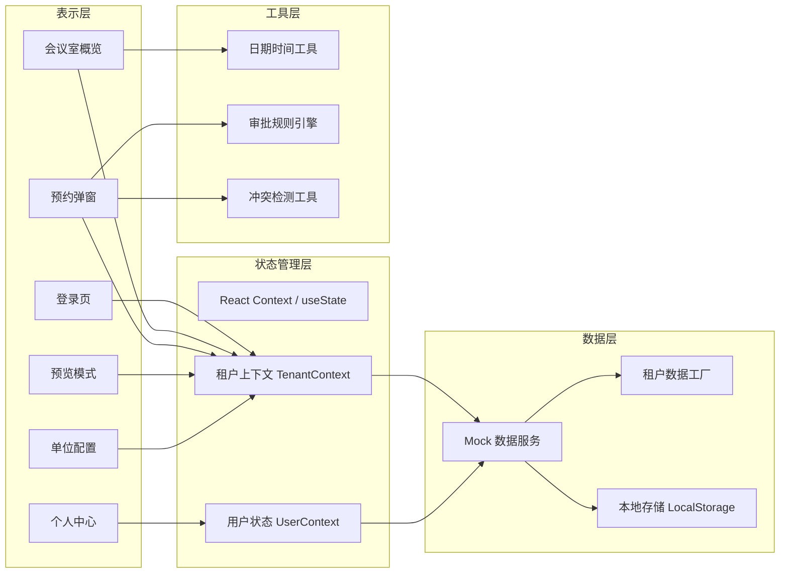
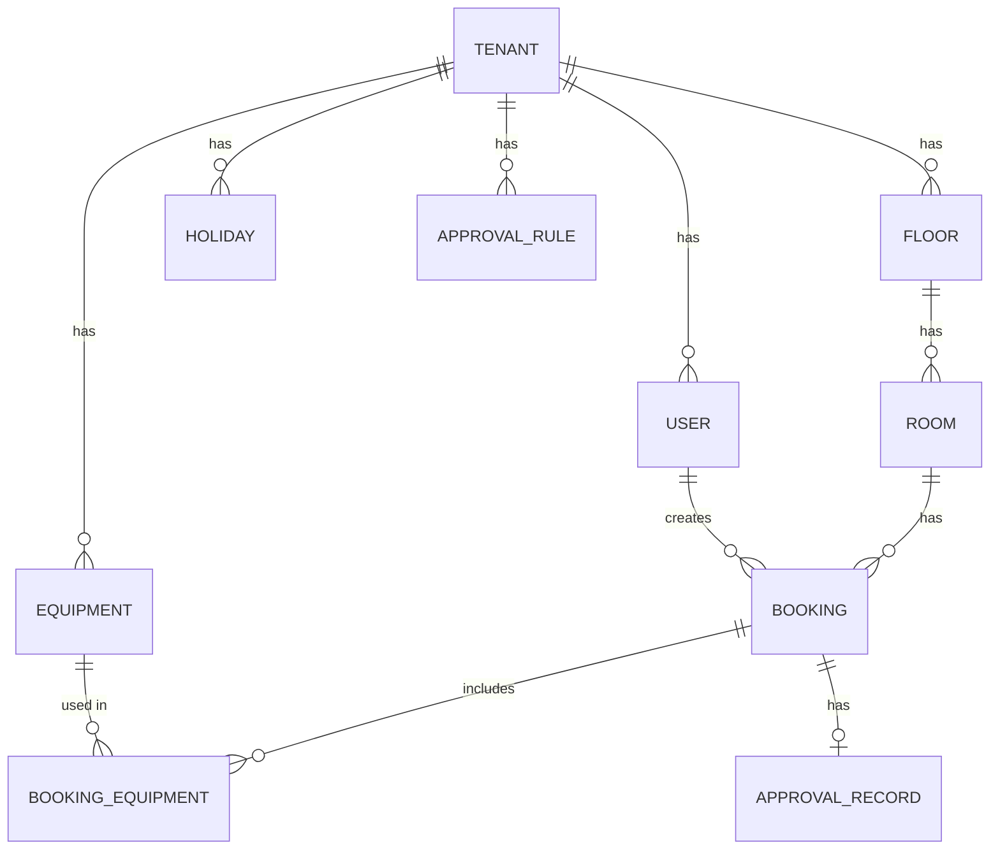

## 1. 架构设计

本项目为纯前端多租户会议室预约系统，采用 React 18 + Vite + Tailwind CSS 技术栈，通过 Mock 数据模拟后端服务，支持多租户数据隔离与切换。



## 2. 技术描述

- **前端框架**：React@18 + TypeScript
- **构建工具**：Vite@5
- **样式方案**：TailwindCSS@3 + CSS 变量
- **路由管理**：React Router DOM@6
- **图标库**：Lucide React
- **状态管理**：React Context + useReducer
- **数据模拟**：Mock 数据 + 本地存储 (LocalStorage)
- **日期处理**：date-fns

## 3. 目录结构

```
src/
├── assets/           # 静态资源
├── components/       # 通用组件
│   ├── layout/       # 布局组件
│   ├── ui/           # 基础UI组件
│   └── meeting/      # 会议相关组件
├── contexts/         # React Context
├── hooks/            # 自定义 Hooks
├── pages/            # 页面组件
│   ├── Login/
│   ├── Dashboard/
│   ├── Preview/
│   ├── Profile/
│   └── Settings/
├── mock/             # Mock 数据
│   ├── tenants/      # 各租户数据
│   └── index.ts
├── types/            # TypeScript 类型定义
├── utils/            # 工具函数
├── App.tsx
├── main.tsx
└── index.css
```

## 4. 路由定义

| 路由 | 页面 | 说明 |
|------|------|------|
| /login | 登录页 | 单位选择、账号登录、预览入口 |
| /dashboard | 会议室概览 | 主页面，时间轴视图 |
| /preview | 预览模式 | 无需登录，模拟查看某单位安排 |
| /profile | 个人中心 | 我的预约、待我审批 |
| /settings | 单位配置 | 管理员可配置本单位信息 |
| / | 重定向 | 登录状态跳转 dashboard，否则跳转 login |

## 5. 数据模型

### 5.1 实体关系图



### 5.2 核心数据类型

```typescript
// 租户（单位）
interface Tenant {
  id: string;
  name: string;
  shortName: string;
  logo?: string;
  workDays: number[]; // 工作日，0=周日，1=周一...
  bookingStartTime: string; // 每日最早可预约时间
  bookingEndTime: string; // 每日最晚可预约时间
  minBookingDuration: number; // 最短预约时长（分钟）
  maxBookingDuration: number; // 最长预约时长（分钟）
}

// 楼层
interface Floor {
  id: string;
  tenantId: string;
  name: string;
  sortOrder: number;
}

// 会议室
interface Room {
  id: string;
  tenantId: string;
  floorId: string;
  name: string;
  capacity: number;
  description?: string;
  equipmentIds: string[];
  sortOrder: number;
}

// 设备
interface Equipment {
  id: string;
  tenantId: string;
  name: string;
  icon: string;
  totalQuantity: number;
}

// 节假日
interface Holiday {
  id: string;
  tenantId: string;
  date: string; // YYYY-MM-DD
  name: string;
  type: 'holiday' | 'makeup'; // 节假日 / 调休补班
}

// 审批规则
interface ApprovalRule {
  id: string;
  tenantId: string;
  name: string;
  enabled: boolean;
  conditions: {
    minCapacity?: number; // 超过此人数需要审批
    durationThreshold?: number; // 超过此时长需要审批
    roomIds?: string[]; // 指定会议室需要审批
  };
  approverIds: string[]; // 审批人ID列表
  approvalType: 'any' | 'all'; // 任意一人通过 / 全部通过
}

// 预约记录
interface Booking {
  id: string;
  tenantId: string;
  roomId: string;
  userId: string;
  title: string;
  description?: string;
  date: string; // YYYY-MM-DD
  startTime: string; // HH:mm
  endTime: string; // HH:mm
  attendeeCount: number;
  equipmentIds: string[];
  status: 'pending' | 'approved' | 'rejected' | 'cancelled';
  createdAt: string;
}

// 用户
interface User {
  id: string;
  tenantId: string;
  username: string;
  name: string;
  role: 'employee' | 'approver' | 'admin' | 'superAdmin';
  department?: string;
  avatar?: string;
}
```

## 6. 多租户实现方案

### 6.1 数据隔离策略

- 所有业务数据均携带 `tenantId` 字段
- 通过 `TenantContext` 提供当前租户信息
- 数据查询时自动过滤当前租户的数据

### 6.2 租户切换机制

- 登录时选择单位，设置当前租户
- 预览模式下可自由切换租户
- 切换租户时清空当前业务数据，重新加载目标租户配置

### 6.3 差异化配置

每个租户独立配置：
- 楼层与会议室
- 设备清单
- 审批规则
- 节假日与工作日
- 预约时段限制

## 7. 核心功能实现要点

### 7.1 时间轴渲染

- 按 30 分钟粒度渲染时间刻度
- 计算每个会议在时间轴上的位置和高度
- 支持拖拽创建预约（可选）
- 冲突检测与可视化提示

### 7.2 审批规则引擎

- 提交预约时匹配所有启用的审批规则
- 满足任一规则条件即触发审批
- 根据规则配置确定审批人列表和审批方式

### 7.3 冲突检测

- 基于时间段重叠算法
- 检测同一会议室同一时间段的预约冲突
- 考虑审批中的预约（占用但可被抢占）

### 7.4 预览模式

- 独立路由，无需登录态
- 提供单位选择器和日期选择器
- 加载对应租户的配置和预约数据
- 以只读方式展示时间轴
